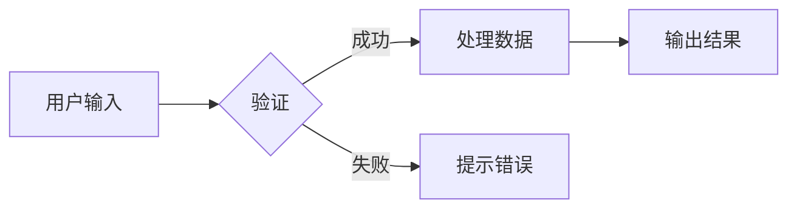
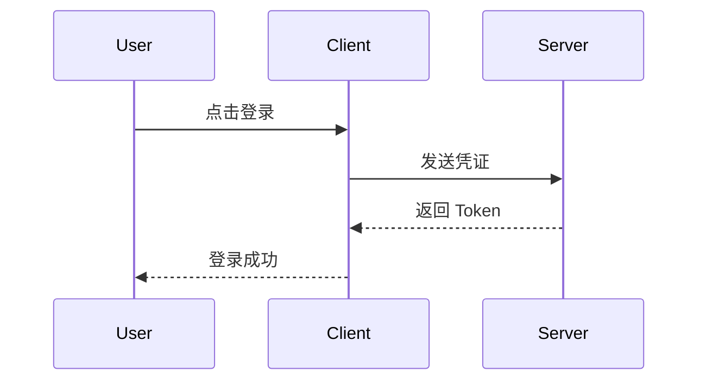
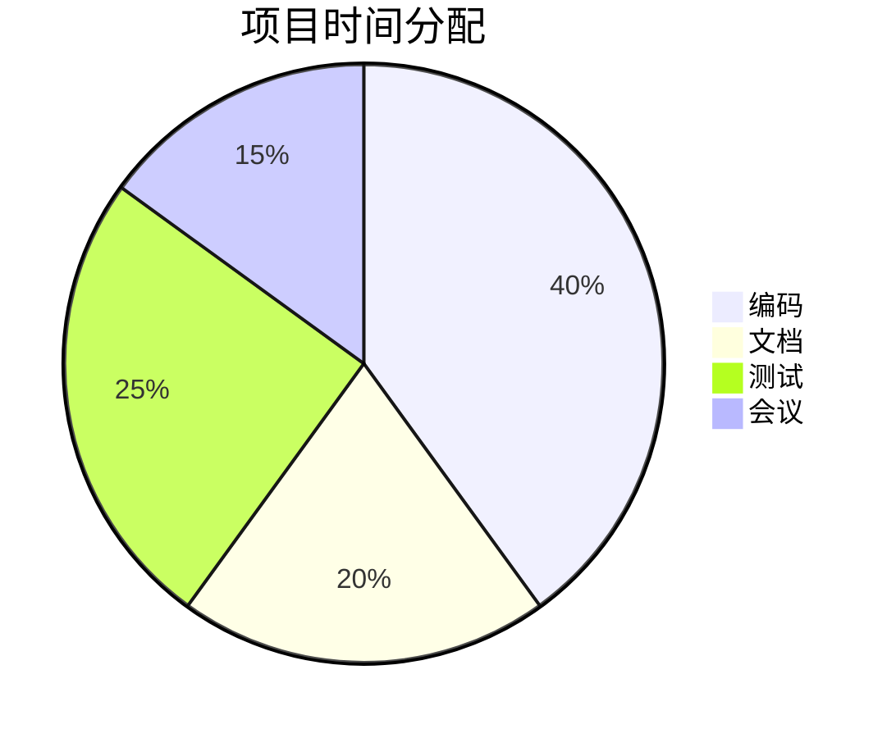

这里是一个涵盖多种常见 Markdown 扩展格式（GFM、Mermaid、数学公式、脚注等）的完整实例文件。你可以将其保存为 `example.md` 并在支持的编辑器（如 VS Code、Typora、Obsidian 或 GitHub）中查看渲染效果。


# Markdown 扩展格式实例文件

> 本文档展示了常用的 Markdown 扩展语法，包括 GFM (GitHub Flavored Markdown)、数学公式、Mermaid 图表等。

## 1. GFM (GitHub Flavored Markdown) 扩展

### 1.1 表格 (Tables)
支持对齐方式设置（左对齐、居中、右对齐）。

| 功能 | 左对齐 | 居中 | 右对齐 |
| :--- | :----- | :--: | -----: |
| 演示 | 文本   | 文本 | 文本   |
| 说明 | `:---` | `:--:` | `---:` |

### 1.2 任务列表 (Task Lists)
用于待办事项管理。

- [x] 完成核心功能开发
- [ ] 编写单元测试
- [ ] 更新文档

### 1.3 删除线 (Strikethrough)
~~这段文字已被划掉。~~

### 1.4 自动链接 (Autolinks)
直接识别 URL：https://www.example.com  
邮箱自动链接：contact@example.com

---

## 2. 数学公式 (Math)
基于 LaTeX 语法，需编辑器支持 KaTeX 或 MathJax。

### 2.1 行内公式
爱因斯坦质能方程：$E = mc^2$

### 2.2 块级公式
$$
\int_{-\infty}^{\infty} e^{-x^2} dx = \sqrt{\pi}
$$

---

## 3. Mermaid 图表
用于绘制流程图、时序图等，需编辑器支持 Mermaid。


### 3.1 流程图 (Flowchart)


### 3.2 时序图 (Sequence Diagram)


### 3.3 饼图 (Pie Chart)


---

## 4. 脚注 (Footnotes)
这是一个引用脚注的例子[^1]。你也可以添加多个脚注[^2]。

[^1]: 这是第一个脚注的详细说明内容。
[^2]: 这是第二个脚注，支持多行内容。  
    第二行内容在这里。

---

## 5. 警告框 (Callouts / Alerts)
常见于 Obsidian、GitHub 或 VuePress 等平台。

> [!NOTE]
> 这是一个普通的提示信息。

> [!TIP]
> 这是一个实用的技巧建议。

> [!WARNING]
> 这是一个需要注意的警告。

> [!CAUTION]
> 这是一个必须谨慎处理的危险提示。

---

## 6. 代码块扩展 (Code Blocks)
### 6.1 语法高亮
指定语言以获得高亮显示：

```python
def fibonacci(n):
    a, b = 0, 1
    for _ in range(n):
        yield a
        a, b = b, a + b
```

```javascript
const greeting = (name) => `Hello, ${name}!`;
console.log(greeting("World"));
```

### 6.2 显示行号 (需编辑器支持)
```javascript {linenos=true}
function add(a, b) {
    return a + b;
}
```

---

## 7. 定义列表 (Definition Lists)
部分 Markdown 解析器支持（如 Pandoc、PHP Markdown Extra）。

术语 1
:   这是术语 1 的定义。

术语 2
:   这是术语 2 的第一部分定义。
:   这是术语 2 的第二部分定义。

---

## 8. 缩写 (Abbreviations)
*[HTML]: HyperText Markup Language
*[CSS]: Cascading Style Sheets
*[JS]: JavaScript

现在当你提到 HTML、CSS 或 JS 时，鼠标悬停会显示全称（需编辑器支持）。

---

## 9. 嵌入内容 (Embeds)
### 9.1 图片 (标准 Markdown)


### 9.2 视频 (需 HTML 支持)

本地视频

<video width="320" height="240" controls>
  <source src="movie.mp4" type="video/mp4">
</video>

B站视频

<iframe width="100%" height="468" src="//player.bilibili.com/player.html?bvid=BV1v84y1o7Cp&high_quality=1" frameborder="no" framespacing="0" allowfullscreen="true"></iframe>

YouTube视频

<iframe width="100%" height="468" src="https://www.youtube-nocookie.com/embed/HS43JC1L2zk?autoplay=1&mute=1" frameborder="0" allowfullscreen></iframe>

---